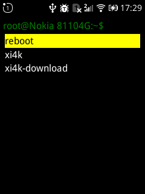

### shell-command

An application for KaiOS to execute shell commands from the Javascript layer.
***This app only works until KaiOS 2.4*** 




**Install.**


download /build/shell-command.zip and install the app with omisd  
for informations how to install please check: https://sites.google.com/view/bananahackers/install-omnisd

create a dir +file on your SD-Card: cmd/cmd.json
with this structur:
```
[
	{"cmd_name":"title of command","cmd":"shell command"},
]
```

**Examples**

reboot

```
[
	{"cmd_name":"reboot","cmd":"reboot"}
]
```


download .JPG files from a Yi4k+ Camera

```
[
		{"cmd_name":"xi4k-download","cmd":"cd /storage/sdcard/yi4k/ && for i in `seq 1 1000`;do curl -fOv http://192.168.42.1/DCIM/100MEDIA/YIAC0$i.JPG; done"}

]
```


## Donation
If you use the app often, please donate an amount to me.
<br>
<table class="border-0"> 
  <tr class="border-0" >
    <td valign="top" class="border-0">
        <div>
            <a href="https://paypal.me/strukturart?locale.x=de_DE" target="_blank">
                
            </a>
        </div>
    </td>
    <td valign="top" class="border-0">
        <div>
            <div>Bitcoin</div>
            
        </div>
    </td>
  </tr>
 </table>